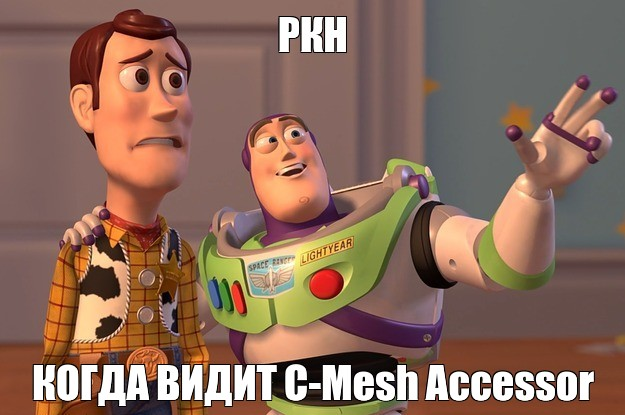

# C-Mesh Accessor

**NO TO RESTRICTIONS // ЗАПРЕТАМ НЕТ**

## 💡 Лысый из Brazzers рекомендует:

> **Лысый:** *"Слушай, а почему у тебя Telegram так медленно работает?"*
>
> **Ты:** *"Да заблокировали всё, не пробиться..."*
>
> **Лысый:** *"Эх, молодежь... Тебе же C-Mesh Accessor нужен! PAC-скрипты, прокси, селективная маршрутизация — всё как я люблю!"*
>
> **Ты:** *"И что, всё работать будет?"*
>
> **Лысый:** *"Будет! Сам пользуюсь. YouTube, Discord, Instagram — всё летает! NO TO RESTRICTIONS, братан!"*
>
> **Ты:** *"А если заблокируют прокси?"*
>
> **Лысый:** *"Тогда новый создаёшь за 5 минут на Cloudflare Workers! Гибко, удобно, анонимно. То что надо!"* 😎

---

**C-Mesh Accessor** — одобрено лысым из Brazzers ✅

## Описание

C-Mesh Accessor — это инструмент для обхода блокировок и умной маршрутизации интернет-трафика.

Расширение для браузера работает в связке с прокси-сервером (Node.js или Cloudflare Workers), позволяя проксировать только выбранные сайты (Telegram, YouTube, Discord и др.) или весь трафик целиком.

**Принцип работы:**
- Браузер → PAC-скрипт → Прокси → Целевой сервер
- Если прокси заблокировали — просто меняешь ссылку в настройках, не перепаковывая расширение

**Ключевые фичи:**
- Минималистичный интерфейс
- Селективная маршрутизация по доменам
- Поддержка wildcard-паттернов (*.example.com)
- Сохранение настроек
- Бэкенд на чистом JavaScript с использованием Factory Pattern
